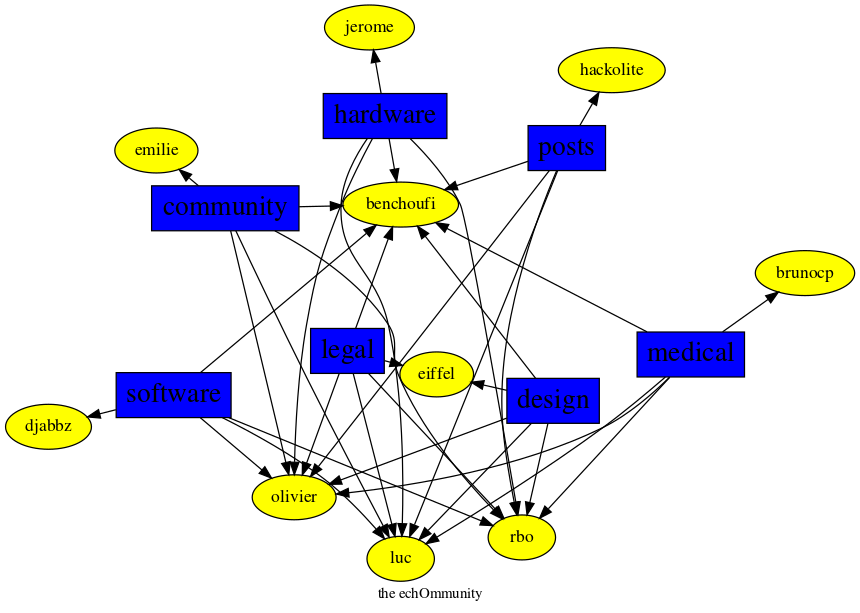

[Home](https://kelu124.github.io/echommunity/)

# What is it?
 This page shows the different spokepersons for the different themes of the project.

### medical

* [@olivier](./U04DFTZ7D.md): 26 posts
* [@brunocp](./U33817K25.md): 22 posts
* [@benchoufi](./U0B47KC3S.md): 19 posts
* [@rbo](./U38HVMZ6K.md): 5 posts
* [@luc](./U0AAL4W13.md): 5 posts

### posts

* [@benchoufi](./U0B47KC3S.md): 832 posts
* [@luc](./U0AAL4W13.md): 648 posts
* [@olivier](./U04DFTZ7D.md): 547 posts
* [@rbo](./U38HVMZ6K.md): 274 posts
* [@hackolite](./U20C8CKTL.md): 209 posts

### legal

* [@luc](./U0AAL4W13.md): 53 posts
* [@olivier](./U04DFTZ7D.md): 35 posts
* [@rbo](./U38HVMZ6K.md): 12 posts
* [@benchoufi](./U0B47KC3S.md): 11 posts
* [@eiffel](./U3GHS132Q.md): 3 posts

### hardware

* [@luc](./U0AAL4W13.md): 27 posts
* [@olivier](./U04DFTZ7D.md): 16 posts
* [@rbo](./U38HVMZ6K.md): 11 posts
* [@benchoufi](./U0B47KC3S.md): 11 posts
* [@jerome](./U07UEJC2H.md): 8 posts

### design

* [@benchoufi](./U0B47KC3S.md): 17 posts
* [@luc](./U0AAL4W13.md): 16 posts
* [@rbo](./U38HVMZ6K.md): 13 posts
* [@olivier](./U04DFTZ7D.md): 11 posts
* [@eiffel](./U3GHS132Q.md): 5 posts

### community

* [@benchoufi](./U0B47KC3S.md): 98 posts
* [@olivier](./U04DFTZ7D.md): 75 posts
* [@luc](./U0AAL4W13.md): 64 posts
* [@rbo](./U38HVMZ6K.md): 31 posts
* [@hackolite](./U20C8CKTL.md): 8 posts

### software

* [@benchoufi](./U0B47KC3S.md): 179 posts
* [@olivier](./U04DFTZ7D.md): 32 posts
* [@luc](./U0AAL4W13.md): 28 posts
* [@rbo](./U38HVMZ6K.md): 25 posts
* [@djabbz](./U2PFHNN3C.md): 21 posts

## Graph 

