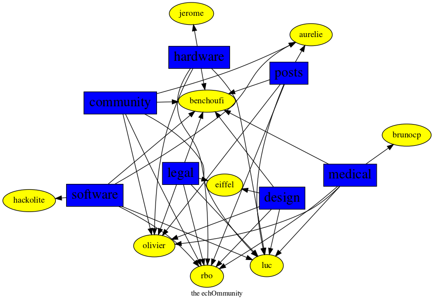

[Home](https://kelu124.github.io/echommunity/)

# What is it?
 ## Disclaimer 
 A small bot is crawling the public channels of the echOpen slack and trying to figure out who is doing what by having a look at the public messages. (_fear not, for it has no access to direct messages / user to user chats / ... _ ). From the topics of discussion, it tries to map the interest of the users.

 It is of course a very raw and rude bot, will miss a lot of things, and is only taking its inspiration from the chat in a basic manner - but you're free to participate to educating this bot. 

 This very page shows the different persons who are speaking the most about some of the different themes of the project.
 Click on the names to further explore profiles, and get direct links to Message them on slack, at the top of their profile pages.

### medical

* [@olivier](./U04DFTZ7D.md): 45 posts
* [@benchoufi](./U0B47KC3S.md): 44 posts
* [@brunocp](./U33817K25.md): 36 posts
* [@luc](./U0AAL4W13.md): 11 posts
* [@rbo](./U38HVMZ6K.md): 10 posts

### posts

* [@benchoufi](./U0B47KC3S.md): 857 posts
* [@luc](./U0AAL4W13.md): 652 posts
* [@olivier](./U04DFTZ7D.md): 552 posts
* [@rbo](./U38HVMZ6K.md): 296 posts
* [@hackolite](./U20C8CKTL.md): 215 posts

### legal

* [@luc](./U0AAL4W13.md): 53 posts
* [@olivier](./U04DFTZ7D.md): 35 posts
* [@rbo](./U38HVMZ6K.md): 12 posts
* [@benchoufi](./U0B47KC3S.md): 11 posts
* [@eiffel](./U3GHS132Q.md): 3 posts

### hardware

* [@luc](./U0AAL4W13.md): 38 posts
* [@olivier](./U04DFTZ7D.md): 32 posts
* [@benchoufi](./U0B47KC3S.md): 30 posts
* [@rbo](./U38HVMZ6K.md): 23 posts
* [@jerome](./U07UEJC2H.md): 19 posts

### design

* [@benchoufi](./U0B47KC3S.md): 24 posts
* [@luc](./U0AAL4W13.md): 17 posts
* [@rbo](./U38HVMZ6K.md): 16 posts
* [@olivier](./U04DFTZ7D.md): 12 posts
* [@eiffel](./U3GHS132Q.md): 5 posts

### community

* [@benchoufi](./U0B47KC3S.md): 100 posts
* [@olivier](./U04DFTZ7D.md): 80 posts
* [@luc](./U0AAL4W13.md): 64 posts
* [@rbo](./U38HVMZ6K.md): 33 posts
* [@hackolite](./U20C8CKTL.md): 8 posts

### software

* [@benchoufi](./U0B47KC3S.md): 184 posts
* [@luc](./U0AAL4W13.md): 34 posts
* [@olivier](./U04DFTZ7D.md): 32 posts
* [@rbo](./U38HVMZ6K.md): 27 posts
* [@djabbz](./U2PFHNN3C.md): 24 posts

## Graph 

